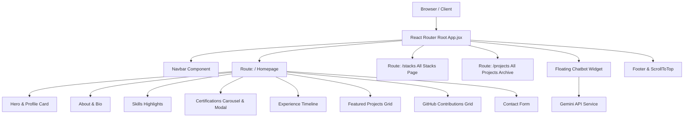

<div align="center">

# ⚡ Allen Del Valle — Personal Portfolio

  <p align="center">
    <strong>A modern, high-performance developer portfolio & interactive showcase built with React, Tailwind CSS, Vite, and Google Gemini AI.</strong>
  </p>

  <p align="center">
    <a href="https://allendelvalle.vercel.app/" target="_blank"><strong>🌐 View Live Demo »</strong></a>
  </p>

  <p align="center">
    <!-- Badges -->
    
    
    
    
    
  </p>
</div>

---

## 📌 Table of Contents

- [Overview](#-overview)
- [Key Features](#-key-features)
- [Tech Stack & Badges](#-tech-stack--badges)
- [Application Architecture](#-application-architecture)
- [Pages & Sub-pages](#-pages--sub-pages)
- [Featured Projects](#-featured-projects)
- [Project Directory Structure](#-project-directory-structure)
- [Local Development Setup](#-local-development-setup)
- [Environment Configuration](#-environment-configuration)
- [Deployment](#-deployment)
- [Author & Contact](#-author--contact)

---

## 🌟 Overview

Welcome to the personal portfolio repository of **Allen Del Valle**, an aspiring AI & Software Engineer and BSIT student at Bicol University.

This application was engineered from the ground up as a component-driven Single Page Application (SPA). It combines modern web aesthetic standards—such as glassmorphism, HSL color tokens, dark/light theme switching, and smooth spring animations—with real-world feature integrations including live GitHub activity tracking, interactive terminal-style skill search filters, and an AI Chatbot powered by Google Gemini.

> [!NOTE]  
> The portfolio is hosted live at **[allendelvalle.vercel.app](https://allendelvalle.vercel.app/)** with automated continuous deployment from the `main` branch.

---

## ✨ Key Features

### 🌓 Seamless Dark & Light Mode
- Adaptive root theme switcher with HSL CSS variables and fast `0.3s ease` universal transitions.
- Persists user theme preference in `localStorage` and respects system `prefers-color-scheme`.

### 🤖 Integrated Gemini AI Assistant
- Floating FAB widget (`#gemini-widget`) that expands into a conversational chat panel.
- Powered by a custom service wrapper for Google's Gemini API, configured to answer questions about Allen's skills, projects, and academic background.

### 📊 Real-Time GitHub Activity Graph
- Displays a 53-week contribution grid for user [`@tsugumii21`](https://github.com/tsugumii21).
- Dynamically aligns month headers, calculates exact commit levels, and features an intelligent simulated fallback engine if rate-limited.

### 🔍 Interactive Tech Stacks Page (`/stacks`)
- Dedicated sub-page displaying full technical skills across 6 categories (Frontend, Mobile, Backend, AI & ML, Developer Tools, Foundational Skills).
- Includes a terminal-themed search bar (`grep -i`) with real-time text highlighting.

### 🗂️ Searchable Projects Archive (`/projects`)
- Filterable archive of mobile apps, web applications, and academic tools.
- Includes category tab filters (*All*, *Mobile*, *Web*, *Academic*) and live keyword search.

### 📜 Certificate Preview Modal Popup
- Zero-scroll modal overlay displaying high-resolution certificate images with verification IDs and metadata.
- Includes direct PDF download links and backdrop blur (`backdrop-filter: blur(8px)`).

---

## 🛠️ Tech Stack & Badges

### 💻 Frontend Engineering


### 📱 Mobile & Backend


### 🧠 AI & Machine Learning


### 🛠️ Developer Tools & Infrastructure


---

## 🚀 Application Architecture



---

## 📖 Pages & Sub-pages

| Route | Page / Component | Description |
| :--- | :--- | :--- |
| `/` | **Main Portfolio Page** | Includes Hero, About, Core Skills, Certifications carousel, Experience, Featured Projects, GitHub activity, and Contact form. |
| `/stacks` | **All Stacks & Skills** | Full inventory of technical capabilities categorized into terminal JSON windows with `grep` live text filtering. |
| `/projects` | **Projects Archive** | Full showcase of developed software with category tab filters (*Mobile*, *Web*, *Academic*) and search bar. |

---

## 💼 Featured Projects

### 1. **Sukli POS**
- **Description:** A point-of-sale system built for small businesses and stalls, supporting inventory management and rapid checkout.
- **Tech Stack:** Flutter, Dart, Supabase
- **Repository:** [`tsugumii21/Sukli_POS`](https://github.com/tsugumii21/Sukli_POS)

### 2. **MERKADO-GO**
- **Description:** Directory and AI Assistant application specifically created for the Ligao City Public Market.
- **Tech Stack:** Flutter, Firebase, Dart, Gemini AI
- **Repository:** [`tsugumii21/MERKADO-GO`](https://github.com/tsugumii21/MERKADO-GO---Ligao-City-Public-Market-Directory-AI-Assistant)

### 3. **BU GWA Calculator & Evaluator**
- **Description:** Academic utility application built for Bicol University students to track GWA records and Latin Honors eligibility.
- **Tech Stack:** HTML5, CSS3, JavaScript
- **Repository:** [`tsugumii21/bu-gwa-calculator-evaluator`](https://github.com/tsugumii21/bu-gwa-calculator-evaluator)

### 4. **M.A.R.I.N.**
- **Description:** Software engineering final project showcasing full-stack capabilities.
- **Tech Stack:** JavaScript, Node.js, MongoDB, React
- **Live Demo:** [M.A.R.I.N. on Render](https://final-project-m-a-r-i-n.onrender.com/)

### 5. **DrivePinas**
- **Description:** Web application platform designed for buying and selling second-hand vehicles in the Philippines.
- **Tech Stack:** HTML5, CSS3, JavaScript
- **Repository:** [`tsugumii21/DrivePinas`](https://github.com/tsugumii21/DrivePinas)

### 6. **DairiX - Dairy Rover Ph**
- **Description:** Logistics and dairy management portal to facilitate operations for Rover Ph.
- **Tech Stack:** HTML5, CSS3, JavaScript
- **Live Demo:** [DairiX Site](https://tsugumii21.github.io/DairiX---Dairy-Rover-Ph/)

---

## 📁 Project Directory Structure

```
Portfolio/
├── public/                     # Static assets (images, PDFs, certificates)
│   ├── assets/
│   │   └── certifications/     # Certificate scans and PDF files
│   ├── config.js               # API Key configuration file
│   └── favicon.ico
├── src/                        # React Source Files
│   ├── components/             # Reusable UI Components
│   │   ├── About.jsx           # Bio section & personal detail items
│   │   ├── Certifications.jsx  # Touch-swipe carousel & popup modal
│   │   ├── Chatbot.jsx         # Gemini AI FAB button & conversation panel
│   │   ├── Contact.jsx         # Validated contact form & socials
│   │   ├── Experience.jsx     # Vertical education timeline
│   │   ├── GithubActivity.jsx  # Live commit activity calendar
│   │   ├── Hero.jsx            # Headline banner & interactive profile card
│   │   ├── Navbar.jsx          # Location-aware responsive header
│   │   ├── Projects.jsx        # Featured 3-project showcase grid
│   │   ├── ScrollToTop.jsx     # Back to top floating trigger
│   │   └── Skills.jsx          # Core tech stack highlight card
│   ├── pages/                  # Router Sub-pages
│   │   ├── AllProjects.jsx     # Full project archive with category tabs
│   │   └── AllStacks.jsx       # Full skills inventory with terminal search
│   ├── services/
│   │   └── gemini.js           # Google Gemini API integration class
│   ├── App.jsx                 # Core router orchestrator & reveal observer
│   ├── index.css               # Tailwind directives & typography tokens
│   ├── main.jsx                # React root mount script
│   └── style.css               # Master visual design system & theme variables
├── firebase.json               # Firebase hosting configuration
├── index.html                  # Main HTML entry file
├── package.json                # Project dependencies & scripts
├── postcss.config.js           # PostCSS configuration
├── tailwind.config.js          # Tailwind CSS theme mappings
└── vite.config.js              # Vite bundler configuration
```

---

## 💻 Local Development Setup

To run this project locally on your machine, follow these steps:

### Prerequisites
- [Node.js](https://nodejs.org/) (v18.0.0 or higher recommended)
- `npm` or `yarn`

### 1. Clone the repository
```bash
git clone https://github.com/tsugumii21/personal-portfolio.git
cd personal-portfolio
```

### 2. Install dependencies
```bash
npm install
```

### 3. Start the Vite development server
```bash
npm run dev
```

The application will be accessible at `http://localhost:5173`.

### 4. Build for Production
To create an optimized production bundle:
```bash
npm run build
```

---

## 🔑 Environment Configuration

The Gemini AI Assistant reads the API key from `public/config.js`:

```javascript
// public/config.js
window.GEMINI_API_KEY = "YOUR_GEMINI_API_KEY_HERE";
```

> [!TIP]  
> If no key is configured in `config.js`, the chatbot widget will gracefully display a friendly notification requesting the API key without crashing the site.

---

## 🌐 Deployment

This application is deployed on **Vercel** with single-page rewrite rules.

### Vercel Deployment Configuration (`vercel.json`)
```json
{
  "rewrites": [
    { "source": "/(.*)", "destination": "/index.html" }
  ]
}
```

---

## 👨‍💻 Author & Contact

**Allen Del Valle**  
*Aspiring AI & Software Engineer | BSIT Student at Bicol University*

- **GitHub:** [@tsugumii21](https://github.com/tsugumii21)
- **Email:** [allendelvalle016@gmail.com](mailto:allendelvalle016@gmail.com)
- **Location:** Ligao City, Philippines
- **Portfolio:** [allendelvalle.vercel.app](https://allendelvalle.vercel.app/)

---

<div align="center">
  <sub>© 2026 Allen Del Valle. All rights reserved.</sub>
</div>
